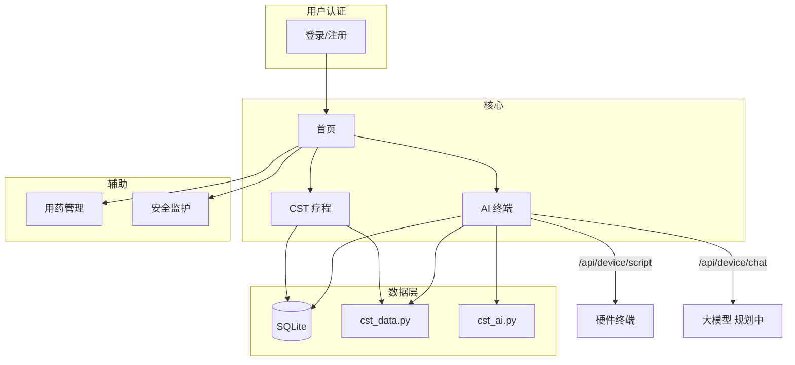

# 记忆港湾 · 功能模块说明

> 面向轻–中度阿尔茨海默症（AD）长者的居家关怀平台。以 **CST（认知刺激疗法）** 为核心，配合 **AI 终端引导**、用药管理与安全监护等辅助模块。

---

## 1. 产品定位

| 维度 | 说明 |
|------|------|
| 目标用户 | 轻–中度 AD 长者；家属 / 照护者 |
| 核心疗法 | CST 标准 14 次疗程 + 后续 MCST 维持期 |
| 差异化 | AI 作为 CST 引导员（非通用聊天），围绕图文、词语、回忆开展对话 |
| 技术栈 | Flask + SQLite + HTML/CSS/JS |
| 运行方式 | 本地 Web：`python app.py` → http://127.0.0.1:5000 |

---

## 2. 信息架构与导航

登录后主导航：

```
首页 · CST 疗程 · AI 终端 · 用药管理 · 安全监护
```

| 模块 | 路由 | 状态 |
|------|------|------|
| 首页 | `/` | ✅ 可用 |
| CST 疗程 | `/cst`、`/cst/session/<n>` | ✅ 14 次均可完成 |
| AI 终端 | `/device` | ✅ 可用（规则式对话演示） |
| 任务清单 | `/tasks` | ✅ 多步日程 + 双端进度 |
| 用药管理 | `/medication` | ✅ 可用（真实 SQLite + 助手 CRUD） |
| 工作台助手 | 全站右下角 | ✅ 登录后可用（DeepSeek 工具调用） |
| 安全监护 | `/safety` | ✅ 演示数据 |
| 用户认证 | `/login`、`/register`、`/forgot-password` | ✅ 可用 |

**已废弃 / 重定向**

| 原路由 | 现行为 |
|--------|--------|
| `/training` | 重定向至 `/cst`（原 MMSE 测验模块已下线） |

**规划中（V1 未实现）**

- CST 第 4–14 次完整交互内容 → ✅ 已完成
- `/family` 家属空间
- `/onboarding` 建档与偏好设置
- `/assessment` MMSE / MoCA 评估
- `/reports` 疗程报告导出
- MCST 维持期 24 次流程

---

## 3. 功能模块详述

### 3.1 用户认证模块

**职责**：账号注册、登录、找回密码；未登录用户无法访问业务页面。

| 功能 | 路由 | 说明 |
|------|------|------|
| 登录 | `GET/POST /login` | 用户名 + 密码，支持 `next` 回跳 |
| 注册 | `GET/POST /register` | 用户名（2–32 位中英文/数字/下划线）、邮箱、密码 |
| 找回密码 | `GET/POST /forgot-password` | 校验用户名与邮箱匹配后重置密码 |
| 退出 | `POST /logout` | 清除 Session |

**数据表**：`users`（含 `role`: `elder` / `family`）、`family_links`（家属 ↔ 老人绑定）

**相关文件**

- `app.py` — 路由与校验逻辑
- `user_auth.py` — 角色与绑定
- `templates/login.html`、`register.html`、`forgot_password.html`
- `static/css/auth.css`、`static/js/auth.js`

---

### 3.2 首页模块

**路由**：`/`

**职责**：CST 导向的登录后工作台，聚合当日任务与四大功能入口。

**展示内容**

- **今日任务**：建议 CST 课次、午间用药、晚间安全巡检
- **CST 进度**：当前课次、完成百分比、强化期阶段
- **现实定向板**：日期、星期、季节、时间、地点（来自 `reality_orientation_context()`）
- **功能卡片**：CST 疗程、AI 终端、用药管理、安全监护（含绑定状态）

**相关文件**：`templates/index.html`、`static/css/home.css`、`static/js/home.js`

---

### 3.3 CST 疗程模块（核心）

**路由**

- `/cst` — 14 次疗程总览
- `/cst/session/<session_num>` — 单次课详情与完成记录

**职责**：按 UCL CST 手册结构提供标准 14 次认知刺激疗程；记录完成进度与课后反馈。

#### 疗程结构

| 阶段 | 说明 |
|------|------|
| 强化期 | 7 周 × 每周 2 次 = **14 次** |
| 维持期 MCST | 24 周 × 每周 1 次 = **24 次**（规划中） |

#### 单次课标准环节（约 45 分钟）

| 环节 | 时长 | 说明 |
|------|------|------|
| 欢迎 | 2 min | 小组称呼、介绍主题 |
| 现实定向板 | 3 min | 日期、星期、地点、天气文字 |
| 图文热身 | 5 min | 展示第一张图卡，描述「看到了什么」 |
| 读图讨论 | 5 min | 围绕图卡细节联系个人经历 |
| 主题主活动 | 25 min | 图卡 + 文字话题，AI 一次一问 |
| 总结反馈 | 5 min | 回顾今日图文与词语 |

#### 14 次主题一览

| 次数 | 主题 | MVP |
|------|------|-----|
| 1 | 图画联想 | ✅ |
| 2 | 声音 | ✅ |
| 3 | 童年 | ✅ |
| 4 | 食物 | ✅ |
| 5 | 时事 | ✅ |
| 6 | 面孔与场景 | ✅ |
| 7 | 词语联想 | ✅ |
| 8 | 创意 | ✅ |
| 9 | 分类 | ✅ |
| 10 | 定向 | ✅ |
| 11 | 用钱 | ✅ |
| 12 | 数字 | ✅ |
| 13 | 文字游戏 | ✅ |
| 14 | 团队问答 | ✅ |

#### 第 1 次课「图画联想」（重点改造）

原「体感游戏」已改为 **看图说话 + 词语联想**，弱化肢体活动，强化文字与图片刺激。

**图卡示例**

| ID | 标签 | 引导方向 |
|----|------|----------|
| `tea_set` | 老茶壶与茶杯 | 描述茶具、联想居家场景 |
| `old_street` | 旧时街景 | 辨认街景细节、联系地点记忆 |
| `family_photo` | 全家福老照片 | 描述照片中人物活动 |
| `fruit_basket` | 时令水果 | 偏好与童年饮食回忆 |

**单次课页面功能**

- 展示课次步骤、活动列表、图卡网格
- 显示 AI 引导语与本课主题说明
- 提交完成记录：心情、备注、AI 摘要
- 一键跳转 AI 终端开始对话

**数据表**

- `cst_profile` — 小组名、主题歌、疗程阶段
- `cst_session_log` — 每课完成状态、心情、备注、AI 摘要、完成时间

**相关文件**

- `cst_data.py` — 14 次主题、图卡、AI 话术、环节模板
- `cst_service.py` — 进度计算、数据库访问
- `templates/cst/index.html`、`templates/cst/session.html`

---

### 3.4 AI 终端模块

**路由**：`/device`

**职责**：绑定硬件 AI 终端；在网页端演示 CST 主题对话；向硬件下发当日 CST 脚本。

#### 页面功能

- 设备绑定 / 解绑（设备名、设备码）
- 在线状态与最近同步时间
- **CST 对话练习区**：图卡舞台、聊天气泡、图卡侧栏
- 展示当次 `system_prompt` 与开场白
- 最近 5 条 CST 完成记录

#### API 接口

**GET `/api/device/script`**

供硬件拉取当日 CST 脚本（JSON）。

```json
{
  "group_name": "记忆港湾小组",
  "theme_song": "一条熟悉的老歌",
  "session_num": 1,
  "session_title": "图画联想",
  "session_theme": "图画联想与词语表达",
  "duration_minutes": 45,
  "steps": [...],
  "activities": [...],
  "visual_cards": [...],
  "reality_orientation": {...},
  "system_prompt": "...",
  "opening_line": "...",
  "ai_role": "CST 引导员：围绕当次主题进行看图说话与词语联想..."
}
```

**POST `/api/device/chat`**

CST 主题对话（当前为规则式引导，硬件可替换为真实大模型 + 相同 `system_prompt`）。

请求体：

```json
{
  "message": "用户回答",
  "turn": 2,
  "session_num": 1
}
```

响应体：

```json
{
  "reply": "引导员回复",
  "step_hint": "main",
  "visual_card": { "id": "tea_set", "label": "...", ... },
  "session_title": "图画联想",
  "theme": "图画联想与词语表达"
}
```

#### AI 引导员约束（`cst_ai.py`）

- 只做 CST 引导，不跑题、不提供医疗建议
- 不纠正记忆错误，用「您刚才提到……」接续
- 短句（一般不超过 25 字），一次只问一个问题
- 多使用「看图说话」「词语联想」「温和讨论」
- 用户沉默时给选项或切换到更简单的图片描述

**数据表**：`device_binding`（`device_name`, `device_code`, `is_online`, `last_sync`）

**相关文件**

- `cst_ai.py` — system prompt、开场白、规则式回复逻辑
- `templates/device/index.html`
- `static/js/cst_chat.js`

---

### 3.4.1 任务清单模块

**路由**：`/tasks`

**职责**：家属创建「有顺序的多步」日程；老人一次只做当前一步；两边共享同一份今日进度。

**家属端**

- 创建任务并拆步（如：洗手 → 拿碗 → 盛饭）
- 今日看板：每件事当前步、完成进度；本周 7 日概况
- 代完成当前步 / 整件做完 / 重置今日进度
- 修改步骤文案：若今天已开始，当日 run 仍用开始时的步骤快照

**老人端**

- 大字只显示当前一步；「做好了」「跳过」「先不做了」「继续」「再说一遍」（朗读）
- 必须按顺序；连点同一操作不会多推一步（`action_id` 幂等）
- 关页 / 换设备后进度保留，从离开的那一步继续

**存储**：`care_tasks` + `care_task_steps` + `care_task_runs`（含 `steps_snapshot`）+ `care_task_step_logs` + `care_task_actions`

**相关文件**：`task_service.py`、`templates/tasks.html`、`static/js/tasks.js`、`static/css/tasks.css`

---

### 3.4.2 CST 个性化练习

**入口**：`/cst/session/<n>`「本次训练题目」

- 家属上传老人照片/文字资料（`cst_materials`）
- 点击「生成训练题目 / 重新随机出题」：DeepSeek 结合课次主题 + 上传资料生成约 10 道温和题（每次随机）
- 题目优先配家属上传的真实照片；无照片时用主题色视觉卡
- 老人与家属均可作答，进度写入 `cst_practice_answers`，两边同步
- **语音互动**：百度 TTS 播报题目（可调语速/音色）→ 浏览器录音 → 百度短语音识别 → 柔和反馈并自动下一题

**相关文件**：`cst_practice_service.py`、`baidu_speech_service.py`、`static/js/speechService.js`、`static/js/cst_practice.js`、`static/css/cst_practice.css`

---

### 3.5 用药管理模块

**路由**：`/medication`

**职责**：药物目录、每日计划、今日记录（含代确认/跳过）与 7 日分析。

**家属端**

- DeepSeek 智能加药聊天框（联网检索说明书 + V4 Flash 整理，确认意图后写入药单）
- 今日服药记录：代确认、跳过、调整计划
- 7 日日程表与依从柱状分析
- 药物目录清单（名称 / 作用效果 / 说明）
- 添加药物：目录选择 → 时间、别名、放置区域

**老人端**

- 今日用药清单（显示别名与放置区）
- 标记已服；本周依从概览

**存储**：SQLite `medications`（含 alias、place_area）+ `medication_log`（status: taken/proxy/skipped）

**REST API**（登录后，作用于当前照护老人）：

| 方法 | 路径 | 说明 |
|------|------|------|
| GET/POST | `/api/medication` | 列表 / 新增 |
| GET | `/api/medication/today` | 今日计划与依从摘要 |
| GET | `/api/medication/today/pending` | 今日未服列表 |
| GET | `/api/medication/week` | 近 7 日 |
| GET/PUT/PATCH/DELETE | `/api/medication/<id>` | 单条查改删 |
| POST | `/api/medication/<id>/status` | 标记 taken/proxy/skipped |

**相关文件**：`medication_service.py`、`med_ai_service.py`、`templates/medication.html`、`static/js/medication.js`

---

### 3.5.1 工作台助手

**入口**：登录后所有页面右下角悬浮按钮「工作台助手」

**能力**：DeepSeek V4 Flash 工具调用，读写真实用药数据（查今日未服、增删改计划、代确认/跳过、智能加药）。

**示例**：问「今天哪些药还没有吃？」→ 调用 `get_today_pending` → 按库内真实待服列表回答。
也可说「创建一个准备午饭的任务：洗手、拿碗、盛饭」→ 调用 `create_care_task` 写入任务清单。

| 方法 | 路径 | 说明 |
|------|------|------|
| POST | `/api/assistant/chat` | `{ message, history }` → `{ reply, tool_trace }` |

能力覆盖：用药 CRUD + 任务清单创建/修改/查询/代完成/重置（DeepSeek 工具调用）。

**相关文件**：`assistant_service.py`、`templates/partials/workspace_assistant.html`、`static/js/workspace_assistant.js`、`static/css/workspace_assistant.css`

---

### 3.6 安全监护模块

**路由**：`/safety`

**职责**：展示居家安全设备状态、告警记录、紧急联系人与定位信息（演示）。

**展示内容**

- 设备列表：定位手环、门磁、活动传感器、紧急按钮
- 告警时间线：正常活动、大门开启、夜间游走等
- 紧急联系人：家属、社区医生
- 当前位置与安全区域

**相关文件**：`templates/safety.html`

---

## 4. 数据模型

SQLite 数据库路径：`instance/users.db`

```
users
├── id, username, email, password_hash, created_at

cst_profile
├── user_id (PK), group_name, theme_song, phase

cst_session_log
├── id, user_id, session_num, status, mood, notes, ai_summary, completed_at
└── UNIQUE(user_id, session_num)

device_binding
├── user_id (PK), device_name, device_code, is_online, last_sync
```

---

## 5. 代码结构

```
web/
├── app.py                 # Flask 主应用、路由、认证
├── cst_data.py            # CST 14 次疗程数据、图卡、环节
├── cst_service.py         # CST 进度与设备 DB 访问
├── cst_ai.py              # AI 引导员 prompt 与对话逻辑
├── questions.py           # 旧 MMSE 题库（已弃用，/training 已重定向）
├── requirements.txt
├── run.bat
├── instance/
│   └── users.db           # SQLite（运行时生成）
├── templates/
│   ├── base.html
│   ├── index.html
│   ├── login.html / register.html / forgot_password.html
│   ├── medication.html / safety.html
│   ├── cst/
│   │   ├── index.html
│   │   └── session.html
│   ├── device/
│   │   └── index.html
│   └── partials/
│       └── dashboard_header.html
└── static/
    ├── css/  (auth.css, home.css, pages.css)
    └── js/   (auth.js, home.js, cst_chat.js)
```

---

## 6. 模块依赖关系



---

## 7. 实现状态总览

| 模块 | 完成度 | 备注 |
|------|--------|------|
| 用户认证 | ✅ 完整 | 生产需更换 `secret_key` |
| 首页 | ✅ 完整 | CST 导向工作台 |
| CST 疗程 | ✅ 完整 | 14 次均可交互完成并写 log |
| AI 终端 | 🟡 演示 | 规则式对话；待接真实 LLM |
| 用药管理 | 🟡 演示 | Session 存储，无家属端 |
| 安全监护 | 🟡 演示 | 静态模拟数据 |
| 家属空间 | ⬜ 未做 | V1 规划 |
| 评估 / 报告 | ⬜ 未做 | V1 规划 |
| MCST 维持期 | ⬜ 未做 | 14 次完成后扩展 |

---

## 8. 启动与体验路径

```powershell
cd "C:\Users\Happy\Desktop\DOCX\水\web"
python app.py
```

浏览器访问 http://127.0.0.1:5000

**推荐体验路径**

1. 注册 / 登录
2. 首页 → 查看 CST 进度与今日任务
3. CST 疗程 → 进入第 1 次「图画联想」→ 浏览图卡与环节
4. AI 终端 → 绑定设备 → CST 对话练习 → 发送回答观察图文引导
5. 返回单次课 → 提交完成记录
6. 用药管理 / 安全监护 → 查看辅助模块演示

---

## 9. 后续迭代建议

1. **补齐 CST 4–14 次**：为每课编写 `SESSION_ENRICHMENT`（图卡、AI followups、环节 override）
2. **接入大模型**：保留 `system_prompt` 契约，替换 `pick_facilitator_reply` 为 LLM 调用
3. **硬件联调**：终端定时拉取 `/api/device/script`，会话上报写回 `cst_session_log`
4. **用药 / 安全持久化**：独立数据表 + 家属只读视图
5. **MCST 维持期**：14 次完成后切换 `cst_profile.phase` 并展示新疗程列表

---

*文档版本：2026-07-20 · 与当前 `web/` 代码库同步*
