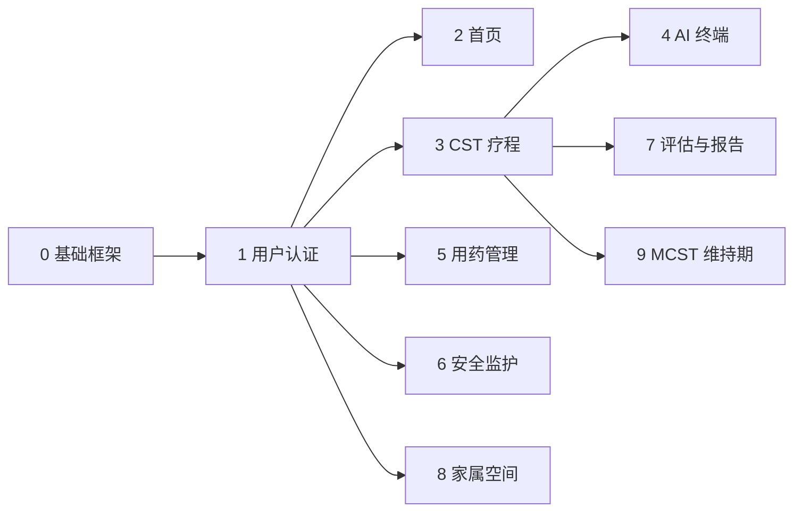

# 记忆港湾 · 开发计划与执行手册

> 依据《功能模块说明》与《工程手册 · 背景调研》编制。  
> **后端**：Flask + SQLite · **前端**：HTML / CSS / JavaScript（Jinja2 模板）  
> **编号规则**：`阶段.模块.任务.步骤`（例：`1.1.1.1` = 阶段 1 · 认证模块 · 任务 1 · 步骤 1）

---

## 目录

1. [技术架构与约定](#1-技术架构与约定)
2. [模块总览与依赖](#2-模块总览与依赖)
3. [各模块说明](#3-各模块说明)
4. [开发阶段划分](#4-开发阶段划分)
5. [开发执行手册（编号任务清单）](#5-开发执行手册编号任务清单)
6. [里程碑与验收标准](#6-里程碑与验收标准)
7. [风险与排期建议](#7-风险与排期建议)

---

## 1. 技术架构与约定

### 1.1 技术选型

| 层级 | 技术 | 说明 |
|------|------|------|
| Web 框架 | Flask 3.x | 路由、Session、Jinja2 渲染 |
| 数据库 | SQLite | `instance/users.db`，开发期够用 |
| 密码 | Werkzeug `generate_password_hash` | 生产环境需 HTTPS |
| 前端 | HTML5 + CSS3 + 原生 JS | 无 React/Vue，适老化大字号 UI |
| 静态资源 | `static/css/`、`static/js/` | 按模块拆分样式与脚本 |
| 模板 | `templates/` + `partials/` | 复用 `base.html`、导航头 |

### 1.2 目录规范（目标结构）

```
web/
├── app.py                      # 路由入口（薄层，只做 HTTP）
├── config.py                   # 配置（SECRET_KEY、LLM API 等）【阶段 3 新增】
├── cst_data.py                 # CST 静态内容与图卡
├── cst_service.py              # CST / 设备 DB 访问
├── cst_ai.py                   # AI prompt 与对话逻辑
├── medication_service.py       # 用药 DB【阶段 4 新增】
├── safety_service.py           # 安全监护 DB【阶段 4 新增】
├── family_service.py           # 家属空间【阶段 5 新增】
├── requirements.txt
├── instance/users.db
├── templates/
├── static/
└── docs/
    ├── 功能模块.md
    └── 开发计划.md              # 本文档
```

### 1.3 编码约定

| 约定 | 规则 |
|------|------|
| 路由命名 | 小写 + 下划线，Blueprint 可选（阶段 3 后拆分） |
| API | `/api/<模块>/<动作>`，JSON 请求/响应 |
| 登录保护 | `@login_required` + `before_request` 双保险 |
| 适老化 UI | 正文 ≥ 16px，主按钮 ≥ 44px 点击区，对比度 ≥ 4.5:1 |
| CST 内容 | 全部写入 `cst_data.py` 的 `SESSION_ENRICHMENT`，禁止硬编码在模板 |

---

## 2. 模块总览与依赖



| 模块编号 | 名称 | 路由前缀 | 当前状态 | 目标版本 |
|----------|------|----------|----------|----------|
| **1** | 用户认证 | `/login` 等 | ✅ 已完成 | V1.0 |
| **2** | 首页工作台 | `/` | ✅ 已完成 | V1.0 |
| **3** | CST 疗程 | `/cst` | ✅ 14 次可完成 | V1.0 → V1.2 |
| **4** | AI 终端 | `/device`、`/api/device/*` | 🟡 规则演示 | V1.1 → V1.3 |
| **5** | 用药管理 | `/medication` | ✅ 家属设定 / 老人打卡 | V1.2 |
| **6** | 安全监护 | `/safety` | 🟡 静态演示 | V1.2 |
| **7** | 评估与报告 | `/assessment`、`/reports` | ⬜ 未做 | V1.3 |
| **8** | 家属空间 | `/family` | ⬜ 未做 | V1.4 |
| **9** | MCST 维持期 | `/cst`（phase 切换） | ⬜ 未做 | V2.0 |

---

## 3. 各模块说明

### 3.1 模块 1 · 用户认证

**目标**：家属/照护者注册账号，未登录无法访问业务页。

| 子功能 | 路由 | 后端 | 前端 |
|--------|------|------|------|
| 登录 | `POST /login` | 校验 hash、写 Session | `login.html` + `auth.css` |
| 注册 | `POST /register` | 唯一性校验、入库 | `register.html` |
| 找回密码 | `POST /forgot-password` | 用户名+邮箱匹配后重置 | `forgot_password.html` |
| 退出 | `POST /logout` | `session.clear()` | 导航表单 |

**数据表**：`users`

**验收**：任意业务 URL 未登录跳转 `/login?next=...`；注册后可直接登录。

---

### 3.2 模块 2 · 首页工作台

**目标**：登录后的 CST 导向总控台，聚合进度、今日任务、四大入口。

| 区块 | 数据来源 | 说明 |
|------|----------|------|
| 现实定向板 | `reality_orientation_context()` | 日期、星期、季节、地点 |
| CST 进度条 | `build_cst_overview()` | 当前课次、完成 % |
| 今日任务 | `app.py` 内 `today_tasks` | CST / 用药 / 安全三条 |
| 功能卡片 | `modules` 列表 | 四模块 + 绑定状态 |

**验收**：进度随 CST 完成记录实时变化；卡片链接正确。

---

### 3.3 模块 3 · CST 疗程（核心）

**目标**：14 次标准 CST + 单次课 45 分钟六环节；图文为主，弱化体感游戏。

#### 3.3.1 疗程页 `/cst`

- 14 次主题列表（完成 / 当前 / 待做）
- 强化期进度、小组名、主题歌
- 「开始本次 CST」跳转当前课次

#### 3.3.2 单次课 `/cst/session/<n>`

| 内容 | 说明 |
|------|------|
| 六环节时间轴 | welcome → ro → warmup → discussion → main → summary |
| 图卡网格 | `visual_cards`（emoji / 后续换真实图片 URL） |
| AI 引导语 | `ai_opening`、`ai_focus` |
| 完成表单 | mood、notes、ai_summary → `cst_session_log` |

#### 3.3.3 14 次主题内容表

| 次数 | 主题 | 内容重点 | 开发优先级 |
|------|------|----------|------------|
| 1 | 图画联想 | 老物件、街景、全家福图卡 | ✅ 已完成 |
| 2 | 声音 | 声音描述卡、收音机、歌词文字 | ✅ 已完成 |
| 3 | 童年 | 风筝、书包图卡 | ✅ 已完成 |
| 4 | 食物 | 食材图、拿手菜文字 | ✅ |
| 5 | 时事 | 生活趣闻短文字卡 | ✅ |
| 6 | 面孔与场景 | 家人照片、街景 | ✅ |
| 7 | 词语联想 | 同类别词卡 | ✅ |
| 8 | 创意 | 色彩 / 想象图卡 | ✅ |
| 9 | 分类 | 物品分类图 | ✅ |
| 10 | 定向 | 地图、定向板文字 | ✅ |
| 11 | 用钱 | 人民币、购物情景 | ✅ |
| 12 | 数字 | 日期数量轻游戏 | ✅ |
| 13 | 文字游戏 | 谚语谜语卡 | ✅ |
| 14 | 团队问答 | 疗程回顾问答 | ✅ |

**数据表**：`cst_profile`、`cst_session_log`

**验收**：MVP 课次可完成并写入 DB；非 MVP 课次显示「完善中」且不可提交。

---

### 3.4 模块 4 · AI 终端

**目标**：硬件拉脚本 + 网页 CST 主题对话；AI 只做引导员，不跑题。

| 能力 | 接口/页面 | 说明 |
|------|-----------|------|
| 设备绑定 | `POST /device` | `device_binding` 表 |
| 脚本下发 | `GET /api/device/script` | 含 steps、visual_cards、system_prompt |
| 主题对话 | `POST /api/device/chat` | 当前规则式 → 阶段 3 接 LLM |
| 网页练习 | `/device` + `cst_chat.js` | 图卡舞台 + 聊天气泡 |

**AI 约束**（`cst_ai.py`）：短句、一次一问、不纠正记忆、不提供医疗建议。

**验收**：对话始终围绕当次 `ai_theme`；图卡随轮次切换；硬件 mock 可拉 JSON。

---

### 3.5 模块 5 · 用药管理

**目标**：维护用药清单、记录服药、展示依从率；后续家属只读。

| 功能 | 说明 |
|------|------|
| 用药 CRUD | 药名、剂量、时间、备注 |
| 服药打卡 | 记录 `taken_at`，计算当日依从率 |
| 7 日趋势 | 从 DB 聚合，替换演示数据 |
| 提醒 | 前端定时 toast（可选 Web Notification） |

**目标数据表**：`medications`、`medication_log`

**验收**：刷新页面后服药记录不丢失；依从率与打卡一致。

---

### 3.6 模块 6 · 安全监护

**目标**：展示设备状态、告警、联系人、定位（演示 → 接 IoT）。

| 功能 | 说明 |
|------|------|
| 设备列表 | 手环、门磁、传感器、SOS |
| 告警时间线 | info / warn / critical |
| 紧急联系人 | CRUD |
| 安全区域 | 定位 + 围栏状态 |

**目标数据表**：`safety_devices`、`safety_alerts`、`emergency_contacts`

**验收**：模拟 API 写入告警后页面刷新可见；SOS 离线有醒目提示。

---

### 3.7 模块 7 · 评估与报告（规划）

**目标**：MMSE/MoCA 简版入口 + CST 疗程 PDF/网页报告。

| 路由 | 说明 |
|------|------|
| `/assessment` | 认知筛查问卷（非诊断） |
| `/reports` | 导出 14 次完成摘要、心情曲线 |

**依赖**：模块 3 完成记录齐全。

---

### 3.8 模块 8 · 家属空间（规划）

**目标**：子女只读查看 CST 进度、用药依从、安全告警。

| 路由 | 说明 |
|------|------|
| `/family` | 绑定长者账号、只看板 |
| `/onboarding` | 首次建档：小组名、主题歌、偏好 |

**依赖**：模块 5、6 持久化完成。

---

### 3.9 模块 9 · MCST 维持期（规划）

**目标**：14 次强化期完成后，`cst_profile.phase` 切为 `maintenance`，展示 24 次轻量 MCST。

**依赖**：模块 3 全部 14 次内容就绪。

---

## 4. 开发阶段划分

| 阶段 | 名称 | 周期建议 | 交付物 |
|------|------|----------|--------|
| **1** | 基础与认证 | 1 周 | 可登录的空壳站点 |
| **2** | CST MVP + 首页 | 2 周 | 1–3 次课可走完 |
| **3** | AI 终端增强 | 2 周 | LLM 对话 + 脚本 API 稳定 |
| **4** | 辅助模块实装 | 2 周 | 用药/安全 DB 化 |
| **5** | CST 全疗程 + 家属 | 3 周 | 14 次课 + 家属看板 |
| **6** | 评估报告 + MCST | 2 周 | V2.0 完整闭环 |

> **当前进度**：阶段 1 ✅ · 阶段 2 ✅（14 次课全部可完成）· 阶段 3 🟡（约 40%）

---

## 5. 开发执行手册（编号任务清单）

> 格式：**`阶段.模块.任务.步骤`**  
> 状态标记：`[x]` 已完成 · `[ ]` 待做 · `[~]` 进行中

---

### 阶段 1 · 项目基础与认证（模块 0–1）

#### 1.0.1 · 项目初始化

| 编号 | 步骤 | 后端（Flask） | 前端（HTML/CSS/JS） | 状态 |
|------|------|---------------|---------------------|------|
| 1.0.1.1 | 创建 Flask 应用骨架 | `app.py`、`requirements.txt` | — | [x] |
| 1.0.1.2 | 配置 SQLite 与 instance 目录 | `get_db()`、`init_db()` | — | [x] |
| 1.0.1.3 | 基础模板与静态目录 | — | `base.html`、`static/` | [x] |
| 1.0.1.4 | 本地启动脚本 | `run.bat`、`app.run()` | — | [x] |

#### 1.1.1 · 用户表与注册

| 编号 | 步骤 | 后端 | 前端 | 状态 |
|------|------|------|------|------|
| 1.1.1.1 | 设计 users 表 | `CREATE TABLE users` | — | [x] |
| 1.1.1.2 | 注册路由与校验 | `validate_username/email/password` | `register.html` 表单 | [x] |
| 1.1.1.3 | 密码哈希入库 | `generate_password_hash` | — | [x] |
| 1.1.1.4 | 注册页样式 | — | `auth.css` 大按钮、错误提示 | [x] |

#### 1.1.2 · 登录与 Session

| 编号 | 步骤 | 后端 | 前端 | 状态 |
|------|------|------|------|------|
| 1.1.2.1 | 登录路由 | `check_password_hash`、写 Session | `login.html` | [x] |
| 1.1.2.2 | 全局登录拦截 | `before_request`、`login_required` | flash 消息区 | [x] |
| 1.1.2.3 | next 回跳 | `request.args.get("next")` | — | [x] |
| 1.1.2.4 | 退出登录 | `POST /logout` | 导航 POST 表单 | [x] |

#### 1.1.3 · 找回密码

| 编号 | 步骤 | 后端 | 前端 | 状态 |
|------|------|------|------|------|
| 1.1.3.1 | 用户名+邮箱校验 | 两步 action：verify / reset | `forgot_password.html` | [x] |
| 1.1.3.2 | 重置密码写库 | `UPDATE password_hash` | 确认密码字段 | [x] |
| 1.1.3.3 | 前端表单校验 | — | `auth.js` 基础校验 | [x] |

---

### 阶段 2 · 首页与 CST MVP（模块 2–3）

#### 2.2.1 · 首页工作台

| 编号 | 步骤 | 后端 | 前端 | 状态 |
|------|------|------|------|------|
| 2.2.1.1 | 首页路由与上下文 | `index()`、`render_dashboard` | `index.html` | [x] |
| 2.2.1.2 | CST 进度数据 | `build_cst_overview()` | 进度条组件 | [x] |
| 2.2.1.3 | 今日任务列表 | `today_tasks` 数组 | 任务卡片 CSS | [x] |
| 2.2.1.4 | 现实定向板 | `reality_orientation_context()` | RO 区块 UI | [x] |
| 2.2.1.5 | 四模块入口卡片 | `modules` 含 url/status | `home.css` 图标卡片 | [x] |
| 2.2.1.6 | 统一导航头 | — | `partials/dashboard_header.html` | [x] |

#### 2.3.1 · CST 数据层

| 编号 | 步骤 | 后端 | 前端 | 状态 |
|------|------|------|------|------|
| 2.3.1.1 | 14 次主题元数据 | `CST_SESSIONS` in `cst_data.py` | — | [x] |
| 2.3.1.2 | 六环节模板 | `CST_STEP_TEMPLATE` | — | [x] |
| 2.3.1.3 | 合并 enrichment | `get_session()`、`_merge_session()` | — | [x] |
| 2.3.1.4 | CST 数据库表 | `cst_profile`、`cst_session_log` | — | [x] |
| 2.3.1.5 | 进度服务 | `cst_service.py` 全套 | — | [x] |

#### 2.3.2 · CST 疗程列表页

| 编号 | 步骤 | 后端 | 前端 | 状态 |
|------|------|------|------|------|
| 2.3.2.1 | `/cst` 路由 | `cst_index()` | `cst/index.html` | [x] |
| 2.3.2.2 | 14 次状态徽章 | completed/current/pending | 列表样式 `pages.css` | [x] |
| 2.3.2.3 | 强化期说明 | `phase_label` | 阶段说明文案 | [x] |
| 2.3.2.4 | 开始本次按钮 | 链接 `current_num` | 主 CTA 按钮 | [x] |

#### 2.3.3 · CST 单次课（1–3 次内容）

| 编号 | 步骤 | 后端 | 前端 | 状态 |
|------|------|------|------|------|
| 2.3.3.1 | 单次课路由 GET | `cst_session(session_num)` | `cst/session.html` | [x] |
| 2.3.3.2 | 第 1 次「图画联想」 | `SESSION_ENRICHMENT[1]` 四图卡 | 图卡网格 UI | [x] |
| 2.3.3.3 | 第 2 次「声音」 | enrichment[2] 声音/收音机卡 | 图卡 + 活动列表 | [x] |
| 2.3.3.4 | 第 3 次「童年」 | enrichment[3] 风筝/书包 | 图卡 + AI 引导语 | [x] |
| 2.3.3.5 | 完成 POST 写 log | INSERT/UPDATE `cst_session_log` | 心情/备注表单 | [x] |
| 2.3.3.6 | 非 MVP 课次拦截 | `mvp_ready` 校验 | 「完善中」提示 | [x] |
| 2.3.3.7 | 跳转 AI 终端 | `url_for('device_index')` | 页内链接按钮 | [x] |

#### 2.3.4 · CST 第 4–14 次内容补齐

| 编号 | 步骤 | 后端 | 前端 | 状态 |
|------|------|------|------|------|
| 2.3.4.1 | 第 4 次「食物」enrichment | 3–4 张食材图卡 + followups | 复用 session 模板 | [x] |
| 2.3.4.2 | 第 5 次「时事」 | 短文字新闻卡 | 文字卡样式 | [x] |
| 2.3.4.3 | 第 6 次「面孔与场景」 | 照片类图卡（注意隐私占位） | 图卡网格 | [x] |
| 2.3.4.4 | 第 7 次「词语联想」 | 词语列表卡 | 词语云 UI | [x] |
| 2.3.4.5 | 第 8 次「创意」 | 色彩/想象图卡 | — | [x] |
| 2.3.4.6 | 第 9 次「分类」 | 分类图片组 | 分类交互 JS | [x] |
| 2.3.4.7 | 第 10 次「定向」 | 地图 + RO 强化 | 定向板组件 | [x] |
| 2.3.4.8 | 第 11 次「用钱」 | 人民币/购物情景卡 | — | [x] |
| 2.3.4.9 | 第 12 次「数字」 | 日期数字轻练习 | — | [x] |
| 2.3.4.10 | 第 13 次「文字游戏」 | 谚语谜语卡 | — | [x] |
| 2.3.4.11 | 第 14 次「团队问答」 | 回顾问答 + 庆祝文案 | 完成页特效 | [x] |
| 2.3.4.12 | 更新 MVP_SESSIONS | 扩展 `{1..14}` | 移除「完善中」限制 | [x] |

---

### 阶段 3 · AI 终端与 LLM（模块 4）

#### 3.4.1 · 设备绑定与页面

| 编号 | 步骤 | 后端 | 前端 | 状态 |
|------|------|------|------|------|
| 3.4.1.1 | device_binding 表 | `ensure_cst_tables` | — | [x] |
| 3.4.1.2 | 绑定/解绑 POST | `device_index()` action | `device/index.html` 表单 | [x] |
| 3.4.1.3 | 在线状态展示 | `is_online`、`last_sync` | 状态徽章 | [x] |
| 3.4.1.4 | 最近完成记录 | `get_all_logs()[-5:]` | 记录列表 | [x] |

#### 3.4.2 · CST AI 话术引擎

| 编号 | 步骤 | 后端 | 前端 | 状态 |
|------|------|------|------|------|
| 3.4.2.1 | 基础 system prompt | `CST_AI_BASE_PROMPT` | — | [x] |
| 3.4.2.2 | 按课次生成 prompt | `build_session_system_prompt()` | 侧栏展示 prompt | [x] |
| 3.4.2.3 | 开场白 | `get_opening_line()` | 聊天气泡首条 | [x] |
| 3.4.2.4 | 规则式回复 | `pick_facilitator_reply()` | — | [x] |
| 3.4.2.5 | 图卡随轮次切换 | `show_card_id` 逻辑 | 图卡舞台区 | [x] |

#### 3.4.3 · 设备 API

| 编号 | 步骤 | 后端 | 前端 | 状态 |
|------|------|------|------|------|
| 3.4.3.1 | GET `/api/device/script` | 返回完整 JSON 脚本 | — | [x] |
| 3.4.3.2 | POST `/api/device/chat` | turn/session_num 参数 | — | [x] |
| 3.4.3.3 | 网页对话客户端 | — | `cst_chat.js` fetch 封装 | [x] |
| 3.4.3.4 | 聊天气泡 UI | — | `device/index.html` 对话区 | [x] |
| 3.4.3.5 | API 鉴权 token | Header `Authorization` 或 device_code | — | [ ] |
| 3.4.3.6 | 会话上报接口 | `POST /api/device/session-log` | — | [ ] |

#### 3.4.4 · 接入大模型

| 编号 | 步骤 | 后端 | 前端 | 状态 |
|------|------|------|------|------|
| 3.4.4.1 | 新增 `config.py` | `LLM_API_KEY`、`LLM_BASE_URL` | — | [ ] |
| 3.4.4.2 | LLM 适配层 | `cst_ai.py` → `call_llm(messages, system_prompt)` | — | [ ] |
| 3.4.4.3 | 保留规则式降级 | LLM 失败时 fallback `pick_facilitator_reply` | toast 提示 | [ ] |
| 3.4.4.4 | 对话历史上下文 | 最近 6 轮 messages 数组 | — | [ ] |
| 3.4.4.5 | 跑题检测与拉回 | prompt 强化 + 关键词检测 | — | [ ] |
| 3.4.4.6 | 流式输出（可选） | SSE `/api/device/chat/stream` | JS EventSource | [ ] |

---

### 阶段 4 · 用药与安全实装（模块 5–6）

#### 4.5.1 · 用药管理持久化

| 编号 | 步骤 | 后端 | 前端 | 状态 |
|------|------|------|------|------|
| 4.5.1.1 | 设计 medications 表 | 药名、剂量、时间、note | — | [x] |
| 4.5.1.2 | 设计 medication_log 表 | user_id、med_id、taken_at | — | [x] |
| 4.5.1.3 | 新建 medication_service.py | CRUD + 依从率计算 | — | [x] |
| 4.5.1.4 | 重构 `/medication` 路由 | 读 DB 替换 `_default_meds()` | — | [x] |
| 4.5.1.5 | 添加/编辑药物表单 | POST action=add/edit | `medication.html` 模态框 | [x] |
| 4.5.1.6 | 服药打卡 | POST action=take | 打卡按钮 + 时间戳 | [x] |
| 4.5.1.7 | 7 日趋势图 | SQL 聚合 → JSON | CSS 柱状条 / 简易 canvas | [x] |
| 4.5.1.8 | 移除 Session 临时存储 | 删除 `meds_taken` session 逻辑 | — | [x] |

#### 4.6.1 · 安全监护持久化

| 编号 | 步骤 | 后端 | 前端 | 状态 |
|------|------|------|------|------|
| 4.6.1.1 | safety_devices 表 | name、type、status、battery | — | [ ] |
| 4.6.1.2 | safety_alerts 表 | level、title、desc、time | — | [ ] |
| 4.6.1.3 | emergency_contacts 表 | name、relation、phone | — | [ ] |
| 4.6.1.4 | 新建 safety_service.py | 设备/告警/联系人 CRUD | — | [ ] |
| 4.6.1.5 | 重构 `/safety` 路由 | 读 DB 替换静态数组 | — | [ ] |
| 4.6.1.6 | 告警级别样式 | — | info/warn/critical 色条 | [ ] |
| 4.6.1.7 | 联系人编辑 UI | POST 表单 | 联系人卡片 | [ ] |
| 4.6.1.8 | 模拟 IoT 写入 API | `POST /api/safety/ingest` | — | [ ] |
| 4.6.1.9 | SOS 离线醒目提示 | 低电量 / 离线置顶 | 红色 banner | [ ] |

---

### 阶段 5 · 家属空间与建档（模块 7–8）

#### 5.7.1 · 首次建档

| 编号 | 步骤 | 后端 | 前端 | 状态 |
|------|------|------|------|------|
| 5.7.1.1 | `/onboarding` 路由 | 首次登录检测 | `onboarding.html` 向导 | [ ] |
| 5.7.1.2 | 编辑小组名/主题歌 | UPDATE `cst_profile` | 表单步骤 1 | [ ] |
| 5.7.1.3 | 长者基本信息 | 新表 `care_recipient` | 表单步骤 2 | [ ] |
| 5.7.1.4 | 完成标记 | `onboarding_done` 字段 | 跳转首页 | [ ] |

#### 5.8.1 · 家属空间

| 编号 | 步骤 | 后端 | 前端 | 状态 |
|------|------|------|------|------|
| 5.8.1.1 | family_links 表 | 家属账号 ↔ 长者 user_id | — | [ ] |
| 5.8.1.2 | `/family` 只读看板 | 聚合 CST/用药/安全 | `family/index.html` | [ ] |
| 5.8.1.3 | 邀请码绑定 | POST 生成/输入 invite_code | 绑定页 | [ ] |
| 5.8.1.4 | 权限中间件 | 家属只能 read | — | [ ] |
| 5.8.1.5 | 导航入口 | 条件显示「家属视图」 | header 链接 | [ ] |

#### 5.7.2 · 评估与报告

| 编号 | 步骤 | 后端 | 前端 | 状态 |
|------|------|------|------|------|
| 5.7.2.1 | `/assessment` 路由 | 复用/精简 `questions.py` | `assessment.html` | [ ] |
| 5.7.2.2 | 评估结果入库 | `assessment_log` 表 | 结果页 | [ ] |
| 5.7.2.3 | `/reports` 路由 | 聚合 cst_session_log | `reports.html` | [ ] |
| 5.7.2.4 | 报告导出 | `render_template` → PDF 或打印 CSS | 打印友好样式 | [ ] |
| 5.7.2.5 | 非诊断免责声明 | 页脚固定文案 | — | [ ] |

---

### 阶段 6 · MCST 与生产就绪（模块 9 + 运维）

#### 6.9.1 · MCST 维持期

| 编号 | 步骤 | 后端 | 前端 | 状态 |
|------|------|------|------|------|
| 6.9.1.1 | phase 切换逻辑 | 14 次完成后 → `maintenance` | 阶段切换动画 | [ ] |
| 6.9.1.2 | MCST 24 次主题数据 | `cst_data.py` MCST_SESSIONS | — | [ ] |
| 6.9.1.3 | 维持期进度 UI | 独立进度条 | `/cst` 双 Tab | [ ] |
| 6.9.1.4 | 单次时长缩短 | 30 分钟环节模板 | — | [ ] |

#### 6.0.1 · 生产与质量

| 编号 | 步骤 | 后端 | 前端 | 状态 |
|------|------|------|------|------|
| 6.0.1.1 | 环境变量配置 | `config.py` + `.env` 示例 | — | [x] |
| 6.0.1.2 | 更换 secret_key | 从环境变量读取 | — | [x] |
| 6.0.1.3 | 清理废弃代码 | 删除/归档 `training.html`、`questions.py` | — | [ ] |
| 6.0.1.4 | 适老化走查 | — | 字号/对比度/焦点态 | [ ] |
| 6.0.1.5 | 错误页 404/500 | `@app.errorhandler` | 友好错误页 | [ ] |
| 6.0.1.6 | 部署文档 | gunicorn / waitress 说明 | — | [x] |

---

## 6. 里程碑与验收标准

| 里程碑 | 编号范围 | 验收标准 | 目标日期（示例） |
|--------|----------|----------|------------------|
| **M1 可登录演示** | 1.x.x.x | 注册登录闭环，空首页 | 第 1 周末 |
| **M2 CST MVP** | 2.x.x.x | 1–3 次课完成并记 log | 第 3 周末 |
| **M3 AI 可用** | 3.4.4.x | LLM 对话 + script API 稳定 | 第 5 周末 |
| **M4 辅助实装** | 4.x.x.x | 用药/安全 DB 化，刷新不丢数据 | 第 7 周末 |
| **M5 全疗程** | 2.3.4.x + 5.x | 14 次课全部可完成 | 第 10 周末 |
| **M6 V2.0** | 6.x.x.x | MCST + 家属 + 报告 | 第 12 周末 |

### 6.1 单模块验收 Checklist（通用）

```
[ ] 路由在未登录时跳转 /login
[ ] POST 表单有 CSRF 或 SameSite 保护（Session cookie）
[ ] 模板无裸 Python 业务逻辑（逻辑在 service 层）
[ ] 移动端 375px 宽度布局不溢出
[ ] 主按钮可键盘 Tab 聚焦
[ ] flash 消息中英文案清晰、无技术术语
```

---

## 7. 风险与排期建议

| 风险 | 影响 | 缓解措施 | 关联编号 |
|------|------|----------|----------|
| CST 4–14 内容撰写慢 | 延期 M5 | 每课先 2 张图卡 MVP，后续迭代 | 2.3.4.x |
| LLM 跑题/幻觉 | AI 体验差 | 保留规则降级 + 严格 system_prompt | 3.4.4.x |
| 真实图片版权 | 法律风险 | 先用 emoji/自制图，后换授权素材 | 2.3.4.x |
| SQLite 并发 | 多用户写入 | 阶段 6 前评估是否迁 PostgreSQL | 6.0.1.x |
| 硬件联调周期 | AI 终端延期 | 先用 Postman mock `/api/device/script` | 3.4.3.x |

### 7.1 推荐迭代顺序（精简路径）

```
1.1.x.x  认证 ✅
   ↓
2.2.x.x  首页 ✅
   ↓
2.3.3.x  CST 1–3 ✅
   ↓
3.4.2.x  AI 规则对话 ✅
   ↓
2.3.4.1–4  补齐食物/面孔/定向/团队问答（P0 四课）
   ↓
3.4.4.x  接 LLM
   ↓
4.5.x.x + 4.6.x.x  用药/安全 DB
   ↓
2.3.4.5–11  剩余 CST 课次
   ↓
5.8.x.x  家属空间
   ↓
6.9.x.x  MCST
```

### 7.2 单人开发周计划示例（接下来 4 周）

| 周次 | 执行编号 | 交付 |
|------|----------|------|
| 第 1 周 | 2.3.4.1–2.3.4.4 | CST 第 4、6、10、14 次（P0 四课） |
| 第 2 周 | 2.3.4.5–2.3.4.11、2.3.4.12 | 剩余课次 + 开放全部提交 |
| 第 3 周 | 3.4.4.1–3.4.4.5、4.5.1.1–4.5.1.6 | LLM 接入 + 用药 DB |
| 第 4 周 | 4.6.1.1–4.6.1.7、5.7.1.1–5.7.1.2 | 安全 DB + 建档向导 |

---

## 附录 A · 编号速查表

| 前缀 | 含义 |
|------|------|
| `1.0.x.x` | 项目初始化 |
| `1.1.x.x` | 用户认证 |
| `2.2.x.x` | 首页 |
| `2.3.x.x` | CST 疗程 |
| `3.4.x.x` | AI 终端 |
| `4.5.x.x` | 用药管理 |
| `4.6.x.x` | 安全监护 |
| `5.7.x.x` | 评估 / 建档 / 报告 |
| `5.8.x.x` | 家属空间 |
| `6.9.x.x` | MCST 维持期 |
| `6.0.x.x` | 生产运维 |

## 附录 B · 关键 API 一览（目标态）

| 方法 | 路径 | 模块 | 编号 |
|------|------|------|------|
| GET | `/api/device/script` | AI 脚本 | 3.4.3.1 ✅ |
| POST | `/api/device/chat` | AI 对话 | 3.4.3.2 ✅ |
| POST | `/api/device/session-log` | 会话上报 | 3.4.3.6 |
| POST | `/api/safety/ingest` | IoT 写入 | 4.6.1.8 |
| GET | `/api/medication/adherence` | 依从率 JSON | 4.5.1.7 |

---

*文档版本：2026-07-20 · 后端 Flask · 前端 HTML/CSS/JS · 与 `功能模块.md` 同步*
